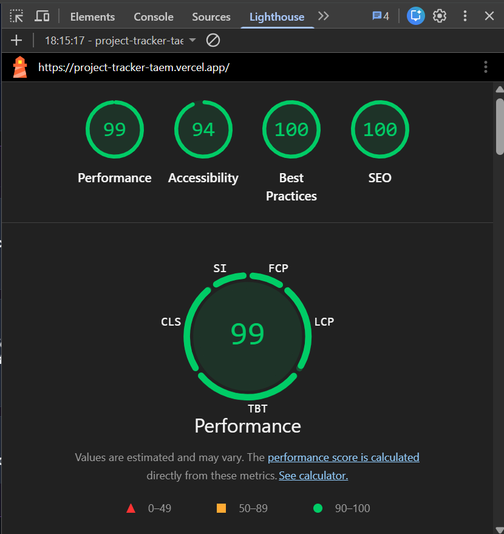

# Velozity Task Board

A high-performance, production-ready React and TypeScript task management application featuring Kanban, List, and Timeline views.

## Setup Instructions

This project is built using React, Vite, Tailwind CSS, and Zustand.

1. **Install Dependencies:**
   ```bash
   npm install
   ```

2. **Run Development Server:**
   ```bash
   npm run dev
   ```

3. **Build for Production:**
   ```bash
   npm run build
   ```

## Architecture & Implementation Details

### State Management Decision (Zustand)
We chose **Zustand** as the global state management solution (`src/store/taskStore.ts`) for the following reasons:
- **Lightweight & Hook-Based:** It avoids the heavy boilerplate of Redux while maintaining a predictable flux-like paradigm.
- **High Performance:** It allows granular subscription to state updates, ensuring components like `TaskCard` or `ListView` only re-render when specifically necessary. 
- **Seamless Integration:** It blends effortlessly with React, making operations like moving tasks or filtering data fast and synchronous without complex provider wrappers.

### Virtual Scrolling Approach
For rendering large volumes of data (e.g., in `ListView`), we implemented a completely custom **Virtual Scrolling engine** (`src/components/VirtualScroll.tsx`) without any external dependencies:
- **Mechanics:** The component tracks the `scrollTop` offset of the container. Instead of rendering all rows in the DOM, it dynamically slices the total list dataset down to only the items visible within the viewport, plus a small overscan buffer (5 items).
- **Positioning:** Every rendered item is given an absolute vertical translation `transform: translateY(...)` corresponding to its index. This ensures UI performance remains blazing fast, at 60fps, even with thousands of tasks, by limiting DOM footprint.

### Custom Drag-and-Drop Engine
The Kanban drag-and-drop functionality (`src/hooks/useCustomDragAndDrop.ts`) was implemented from scratch using the native **Pointer Events API** (not HTML5 Drag and Drop or external libraries like `dnd-kit`):
- **Universal Support:** Point Event APIs cleanly handle both mouse and touch interactions, ensuring seamless drag-and-drop out-of-the-box on desktop and mobile.
- **Visual Mechanics:** When a drag starts, the original DOM node is hidden, a placeholder takes its spot to maintain layout structure, and a visual clone is absolutely positioned to follow the pointer cursor via `clientX/Y`.
- **Hit Testing:** As the user drags the clone, we perform collision hit-testing against designated drop zones (`[data-drop-zone="..."]`) using `getBoundingClientRect`. On drag release, the engine correctly shifts the task's state or initiates a "snapback" animation fallback.

## Explanation

The most challenging UI problem to solve was building a high-performance, custom drag-and-drop engine that worked seamlessly across both desktop and touch devices without relying on heavy external libraries like `dnd-kit`. Ensuring that the drag interaction felt fully synchronous and jank-free, while simultaneously updating the visual DOM state across different Kanban columns, required careful management of React's render cycles and direct DOM manipulations.

To handle the drag placeholder without causing any jarring layout shifts, we calculate the exact dimensions (width and height) of the original task card using `getBoundingClientRect()` at the moment the pointer goes down. We then instantly inject an empty `<div>` placeholder matching those exact dimensions into the original task's DOM position. This preserves the exact spatial footprint of the dragged item within the column flexbox, completely eliminating any layout recalculations or column collapsing while the visual clone is dragged freely around the screen via absolute positioning. 

If given more time, one key area I would refactor is the state management filtering logic within the `taskStore.ts`. Currently, the filtering and sorting algorithms execute synchronously on every state change. While acceptable for a few hundred items, as the dataset grows significantly larger, I would refactor this by offloading the heavy `applyFilters` and `sortTasks` computations to a Web Worker, or by implementing more fine-grained, memoized proxy selectors to prevent main-thread blocking during critical render paths.

## Lighthouse Audit


> *Note: Add your generated `lighthouse.png` file to the root/public directory for the screenshot to appear here.*
